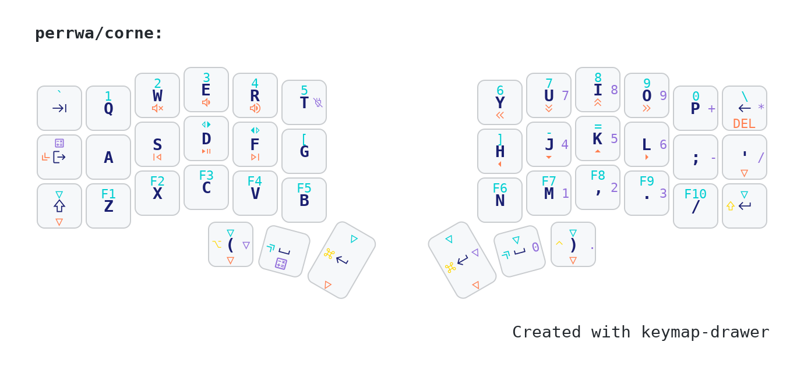

# ZMK Config

This repository contains configuration files for the **Corne-Cherry v3.0.1** keyboard using [ZMK Firmware](https://zmk.dev/). It includes keymaps, overlays, and shield definitions, as well as visual representations of the keymap.

## Hardware and Wireless Module

This configuration is designed for:

- **Corne-Cherry v3.0.1**
- **Raytac nRF52840** module (e.g., [MDBT50Q-RX](https://www.raytac.com/product/ins.php?index_id=89))
- **Nice!Nano v2** controllers

## Repository Structure

```
├── boards/
│   └── shields/
│       └── corne/
│           ├── corne_dongle.conf
│           ├── corne_dongle.overlay
│           └── Kconfig.shield
├── config/
│   ├── corne.conf
│   ├── corne.keymap
│   └── west.yml
├── keymap-drawer/
│   ├── config.yaml
│   ├── corne.png
│   ├── corne.svg
│   └── corne.yaml
├── zephyr/
│   └── module.yml
├── build.yaml
```

## Keymap Visualization

Keymap images are generated using [keymap-drawer](https://github.com/caksoylar/keymap-drawer) by [caksoylar](https://github.com/caksoylar).




## Files Overview

- `boards/shields/corne/`: Raytac dongle-specific shield and overlay files
- `config/`: Main Corne configuration and keymap files
- `keymap-drawer/`: keymap-drawer artifacts and configs

## Resources

- [ZMK Documentation](https://zmk.dev/docs/)
- [Corne Keyboard Info](https://github.com/foostan/crkbd)
- [Raytac Dongle ZMK Component (by rschenk)](https://github.com/rschenk/zmk-component-raytac-dongle)
- [keymap-drawer (by caksoylar)](https://github.com/caksoylar/keymap-drawer)

## License

This project is licensed under the MIT License. See [LICENSE](LICENSE) for details.
