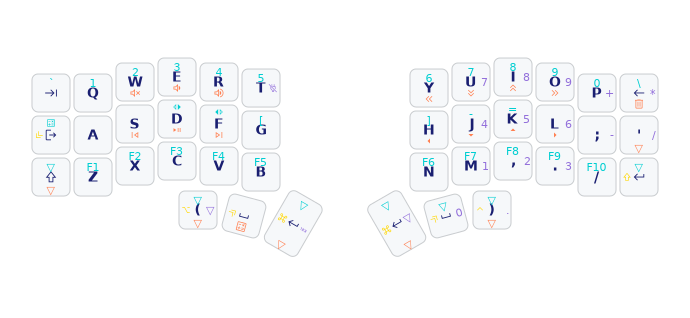

# ZMK Config

[ZMK Firmware](https://zmk.dev/) configuration for a split **Corne-Cherry v3.0.1** keyboard with a BLE dongle acting as the central receiver.

## Hardware

- **Corne-Cherry v3.0.1** — split 3×6+3 keyboard ([foostan/crkbd](https://github.com/foostan/crkbd))
- **Nice!Nano v2** — controllers for each half (BLE peripherals)
- **Raytac MDBT50Q-RX** — USB dongle running as BLE central ([rschenk/zmk-component-raytac-dongle](https://github.com/rschenk/zmk-component-raytac-dongle))

## Keymap

Four layers with mod-tap (`&mt`) and layer-tap (`&lt`) thumb keys:

| Layer | Name | Description |
|-------|------|-------------|
| 0 | QWERTY | Base alpha layer |
| 1 | Symbols | Numbers, brackets, F1–F10 (hold Space) |
| 2 | Nav | Arrows, Home/End/PgUp/PgDn, media controls (hold Esc) |
| 3 | Numpad | Numeric keypad and operators (toggled from L1 or L2) |



## Build & Firmware

All builds run in GitHub Actions — no local toolchain needed.

| Workflow | Trigger | What it does |
|----------|---------|--------------|
| `build.yml` | PRs, manual dispatch | CI build for all targets |
| `release.yml` | Tag push `v*`, manual dispatch | Builds firmware → draft prerelease |
| `draw-keymaps-unified.yml` | Keymap/config changes | Regenerates keymap SVGs and YAML |

The build matrix (`build.yaml`) produces firmware for:

- **Dongle** — `corne_dongle` shield on `raytac_mdbt50q_rx`
- **Left/Right halves** — `corne_left`/`corne_right` on `nice_nano_v2` with `-DCONFIG_ZMK_SPLIT_ROLE_CENTRAL=n`
- **Settings reset** — for both boards

### Dongle flashing

The `Makefile` handles DFU packaging and serial flashing for the Raytac dongle (requires `nrfutil nrf5sdk-tools`):

```
make dfu      # Package .bin/.hex → .zip DFU bundles
make flash    # Interactive serial port + package selection
make clean    # Remove generated .zip packages
```

## Repository Structure

```
├── boards/shields/corne_dongle/   # Dongle shield: overlay, conf, Kconfig
├── config/
│   ├── corne.conf                 # Keyboard settings (sleep, battery, BLE)
│   ├── corne.keymap               # Keymap (Devicetree syntax)
│   └── west.yml                   # West manifest — ZMK v0.3 + Raytac dongle module
├── keymap-drawer/                 # Auto-generated keymap visualizations
│   ├── corne.svg / corne.yaml     # Per-layer output
│   ├── corne-unified.svg / .yaml  # All layers merged into one view
│   └── merge_layers.py            # Script that produces the unified view
├── zephyr/module.yml              # Registers repo as a Zephyr module
├── build.yaml                     # GitHub Actions build matrix
├── keymap_drawer.config.yaml      # keymap-drawer styling config
└── Makefile                       # DFU packaging and dongle flashing
```

## Resources

- [ZMK Documentation](https://zmk.dev/docs/)
- [Corne Keyboard (foostan/crkbd)](https://github.com/foostan/crkbd)
- [Raytac Dongle ZMK Component (rschenk)](https://github.com/rschenk/zmk-component-raytac-dongle)
- [keymap-drawer (caksoylar)](https://github.com/caksoylar/keymap-drawer)

## License

MIT — see [LICENSE](LICENSE).
