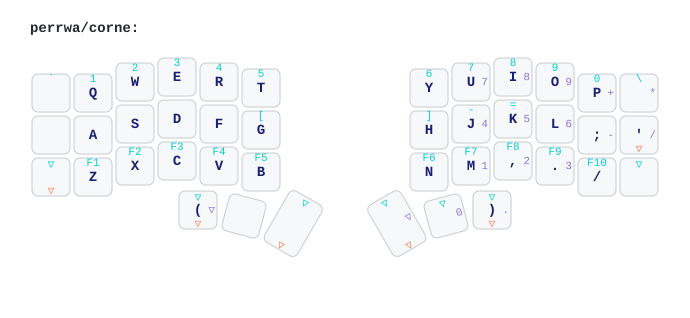

# ZMK Config

[](https://github.com/perrwa/zmk-config/actions/workflows/release.yml)
[](https://github.com/perrwa/zmk-config/actions/workflows/build.yml)

[ZMK Firmware](https://zmk.dev/) configuration for a split Corne-Cherry v3.0.1 keyboard with a BLE dongle acting as the central receiver.

## Hardware

| Part | Role |
|------|------|
| Corne-Cherry v3.0.1 ([foostan/crkbd](https://github.com/foostan/crkbd)) | Split 3×6+3 keyboard |
| Nice!Nano v2 | Controller for each half (BLE peripheral) |
| Raytac MDBT50Q-RX or MDBT50Q-CX-40 | USB dongle running as BLE central ([rschenk/zmk-component-raytac-dongle](https://github.com/rschenk/zmk-component-raytac-dongle)); firmware for both is built from the same config |

## Keymap

Four layers with mod-tap (`&mt`) and layer-tap (`&lt`) thumb keys:

| Layer | Name | Description |
|-------|------|-------------|
| 0 | QWERTY | Base alpha layer |
| 1 | Symbols | Numbers, brackets, F1–F10 (hold Space) |
| 2 | Nav | Arrows, Home/End/PgUp/PgDn, media controls (hold Esc) |
| 3 | Numpad | Numeric keypad and operators (toggled from L1 or L2) |



## Build & Firmware

All builds run in GitHub Actions, no local toolchain needed. `build.yaml` is the source of truth for board names; the long-lived `zmk-v0.4` branch tracks unreleased ZMK and uses newer HWMv2 board names (`mdbt50q_rx`, not `raytac_mdbt50q_rx`). `build.yml` never runs on `main` (only PRs and pushes to `zmk-v0.4`), so `main`'s build status badge above tracks `release.yml` instead — it builds the same firmware on every push to `main`.

| Workflow | Trigger | What it does |
|----------|---------|--------------|
| `build.yml` | PRs to main, push to `zmk-v0.4`, manual dispatch | CI build for all targets |
| `release.yml` | Push to main, manual dispatch | Builds firmware, then a draft prerelease (auto-tags `vYY.MM.N`) |
| `draw.yml` | Keymap/config changes | Regenerates keymap SVGs and YAML |

The build matrix (`build.yaml`) produces firmware for:

| Target | Boards | Notes |
|--------|--------|-------|
| Dongle | `corne_dongle` shield on both Raytac boards | Each advertises under its own BLE name (`perrwa-crkbd-rx` / `perrwa-crkbd-cx`) so they're distinguishable when pairing |
| Left/right halves | `corne_left`/`corne_right` shields on `nice_nano_v2` | Peripheral role is set explicitly in the halves' `.conf` files |
| Settings reset | All boards | — |

### Dongle flashing

The `Makefile` handles DFU packaging and serial flashing for either Raytac dongle (requires `nrfutil nrf5sdk-tools`):

```
make dfu      # Package .bin/.hex → .zip DFU bundles
make flash    # Interactive serial port + package selection
make clean    # Remove generated .zip packages
```

## Repository Structure

```
├── boards/shields/corne_dongle/   # Dongle shield: overlay, conf, Kconfig
├── config/
│   ├── corne.conf                 # Keyboard settings (sleep, battery, BLE)
│   ├── corne.keymap               # Keymap (Devicetree syntax)
│   └── west.yml                   # West manifest: ZMK + Raytac dongle module
├── keymap-drawer/                 # Auto-generated keymap visualizations
│   ├── corne.svg / corne.yaml     # Per-layer output
│   ├── corne-unified.svg / .yaml  # All layers merged into one view
│   └── merge_layers.py            # Script that produces the unified view
├── zephyr/module.yml              # Registers repo as a Zephyr module
├── build.yaml                     # GitHub Actions build matrix
├── keymap_drawer.config.yaml      # keymap-drawer styling config
└── Makefile                       # DFU packaging and dongle flashing
```

## Resources

- [ZMK Documentation](https://zmk.dev/docs/)
- [Corne Keyboard (foostan/crkbd)](https://github.com/foostan/crkbd)
- [Raytac Dongle ZMK Component (rschenk)](https://github.com/rschenk/zmk-component-raytac-dongle)
- [keymap-drawer (caksoylar)](https://github.com/caksoylar/keymap-drawer)

## License

MIT, see [LICENSE](LICENSE).
